# Gruppe 3

# – ESP8266 mit TFT und DHT12 Sensor

Potozki Martin & Schiff Marvin

Gewerblich Technische Schule Offenburg

# Inhaltsverzeichnis

[Einführung 2](#Einführung)

[Verdrahtung der Komponenten 2](#VerdrahtungderKomponenten)

[DHT12 6](#DHT12)

[WebServer 8](#WebServer)

[TFT-Bildschirm 9](#TFT)

[Zeichnen der Graphen 14](#ZeichnenderGraphen)

[Zeichnen der Sensordaten 15](#ZeichnenderSensordaten)

[Auto-Aktualisierung des Bildschirm 16](#Auto-AktualisierungdesBildschirm)

[Wohlgeformtes XML 17](#WohlgeformtesXML)

[Allgemeines zum JSON-Format 18](#AllgemeineszumJSON-Format)

[Speichern und Laden einer JSON-Datei 20](#SpeichernundLadeneinerJSON-Datei)

[Die handleroot Funktion und die HTML 21](#DiehandlerootFunktionunddieHTML)

[Probleme und Lösungen 28](#ProblemeundLösungen)

[Kommunikationsplan 29](#Kommunikationsplan)

[Schlusswort 30](#Schlusswort)

[Literaturverzeichnis 31](#Literaturverzeichnis)

# Einführung

Das Projekt begann am 11-05-2022. Bis zu diesem Tag haben wir die Sensoren entdeckt, mit denen wir arbeiten sollten. Diese sind ein DHT12 und ein TFT-Bildschirm. Wir machten uns schnell auf die Suche nach Libraries für unsere Sensoren. Natürlich gibt es im Internet viele verschiedene Libraries, und wir stießen auf einige, die überhaupt nicht funktionierten. Aber das hat uns nicht entmutigt! Denn wie jeder Entwickler ist auch unser Antrieb der Erfolg unseres Programms.

# Verdrahtung der Komponenten

Bevor wir beginnen stellen wir unsere Komponenten und den Verdrahtungsplan vor.

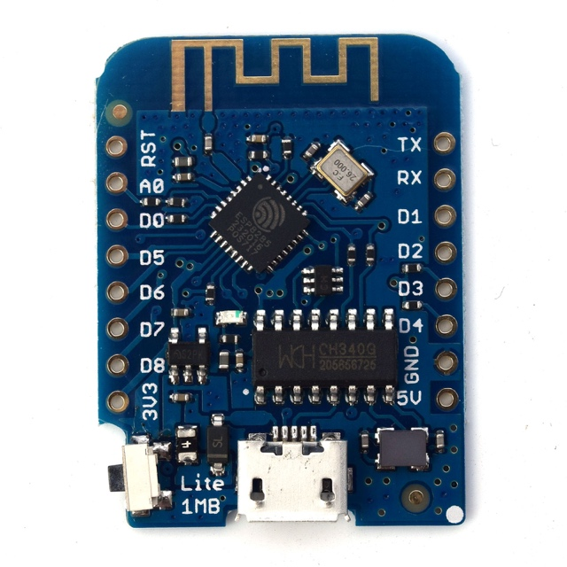

_Figure 1: D1 Mini Lite_

Unser Microcontroller auf den wir unseren Micropython Server umsertzen (Figure 1).

_Figure 2: DHT SHield_

Der DHT Shield von Wemos mit einem DHT12 Sensor zum Messen von Temperatur und Feuchtigkeit (Figure 2).

_Figure 3: TFT 1.4 Shield (vorne)_

_Figure 4:TFT 1.4 Shield (hinten)_

Der Bildschirm ist ein 1.44" TFT LCD von Wemos (Figure 3 und 4).

_Figure 5: Dual Base ProtoBoard_

Ein einfaches Erweiterungsboard das uns die Steckverbindungen verdoppelt, sodass alles einfach zusammengesteckt werden kann.

_Figure 6: Zusammengebaut (Photo)_

Hier sehen wir das ganze zusammen (Figure 6).

Im Folgendenen zeigen wir anhand einer Skizze, wie die Verdrahtung genau aussieht.

_Figure 7: Verdrahtung_

Die Pins D3(0), D4(2) und D8(15) des TFT werden mit D3, D4 und D8 am D1 Mini verbunden. Die Pins D1(5) und D2(4) werden mit D1 und D2 am D1 Mini verbunden (Figure 7).

# DHT12

Unser erstes Ziel war der DHT12-Treiber. Die DHT-12 library ermöglicht uns das Auslesen der PIN-Informationen unseres Sensors. Zurück bekommen wir die Temperatur und Feuchtigkeitswerte des Sensors.

Wir haben den Treiber auf Github gefunden: [https://github.com/mcauser/micropython-dht12](https://github.com/mcauser/micropython-dht12) .

Wir haben die Python-Datei heruntergeladen und unter dem Namen dht12.py auf den Mikrocontroller gesichert.

Mit dem Treiber auf dem Controller folgt nun die Implementierung. Dazu müssen wir zunächst die entsprechenden Module importieren:

from machine import I2C, Pin

I2C ist die Schnittstelle für das Board, auf der sich der Sensor befindet, und Pin ist das Modul, um auszuwählen auf welcher PIN die Informationen gelesen werden.

Nun müssen wir das Modul aus der Datei dht12.py importieren. Dazu geben wir folgende Importzeile ein :

from dht12 import DHT12

Anschließend müssen wir festlegen, auf welcher PIN sich unser I2C befindet.

Die richtigen Pins entnehmen wir dem Datenblatt des Wemos DHT Shields auf der Webseite: [https://www.wemos.cc/en/latest/d1\_mini\_shield/dht.html](https://www.wemos.cc/en/latest/d1_mini_shield/dht.html)

Dazu geben wir den folgenden Code ein:

I2c = IC2(scl=Pin(5), sda=Pin(4))

Mit diesem Code legen wir Pub 5 als scl und Pin als sda für die I2C Schnittstelle fest.

Wir haben uns entschieden, eine Variable "sensor" zu erstellen, damit wir nicht vor jeder Messung eine lange Zeichenfolge eingeben müssen:

sensorDht12 = DHT12(i2c)

Jetzt müssen wir nur noch den Sensor mit folgendem Befehl starten:

sensorDht12.measure()

Zur Datenausgabe nurzen wir folgende Befehle :

sensorDht12.temperature()

sensorDht12.humidity()

Dann starteten wir das Programm. Und das war ein Erfolg! In der Konsole konnten wir die Werte der Sensoren sehen. Da wir wussten, dass unser Sensor funktioniert, wandten wir uns nun der Erstellung der Webseite zu.

# WebServer

Wir haben das Webserver-Programm von unserem Lehrer erhalten.

Das Starterpaket beinhaltet folgende Dateien:

ESP8266WebServer.py

Webserver.py

WifiConnect.py

Wir haben leider die DhtServer.py Datei übersehen, aber das war kein Problem denn wir konnten die gleichen Funktionen mit der Wifiserver.py ebenso selbst umsetzen.

Wir haben die WifiServer.py zunächst in main.py umbenannt denn hier wird unser code implementiert.

Als nächstes geben wir die Wlan Daten an.

Daraufhin gelang es dem Controller sich mit dem Netzwerk zu verbinden, und wir konnten die Webseite in einem Client-Browser aufrufen.

Mit unserem dht12, gestalteten wir den Code der Webseite, um die Werte der Sensoren zu übermitteln.

Unser Sensor kommuniziert über die ic2 Schnittstelle, was in der Initialisierung angegeben werden muss.

Allerdings muss darauf geachtet werden, wo der Code platziert wird. Denn das Das Auslesen der Sensordaten muss vor dem Start der Website erfolgen.

In diesem Screenshot sehen wir, dass der Server nach der Initialisierung und dem Auslesen der Sensoren startet.  server.begin()

Nach der Ausführung unseres Codes konnte der Server ohne Fehler gestartet werden und beim Laden der Seite konnten wir die Werte der Sensoren auslesen.

Wir verwenden RTC() da wir die Zeit sowohl für das loggen der Zeit in der Json, als auch für das Zeichnen der Daten auf dem Bildschirm und dem Speichern der JSON benötigen.

Wir speichern in currentTime die aktuelle Zeit und überschreiben diese immer wenn der Sekundenwert sich verändert (Figure 8).

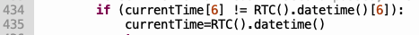

_Figure 8: currentTime Verwendung_

# TFT-Bildschirm

Bei dem Bildschirm hatten wir große Schwierigkeiten, ihn zum Funktionieren zu bringen. Denn nach vielen Versuchen und getesteten Libraries haben wir endlich eine gefunden, die funktioniert:

[https://github.com/adafruit/micropython-adafruit-rgb-display/blob/master/st7735.py](https://github.com/adafruit/micropython-adafruit-rgb-display/blob/master/st7735.py)

Diese Library wurde von Adafruit für Micropython geschrieben, wird seit einigen Jahren nicht aktualisiert und beinhaltet entweder Fehler oder ist mit diesem TFT Bildschirm nicht ganz kompatibel. Leider fanden wir keine bessere mit mehr Dokumentation.

Mithilfe dieser Bibliothek können wir über den Mikrocontroller kommunizieren, wie die Informationen auf dem Bildschirm angezeigt werden. Um jedoch ganze Texte anzeigen zu können, benötigen wir zusätzliche Bibliotheken wie rgb.py für die verschiedenen Draw-Funktionen, sowie rgb\_text.py, um ganze Texte anzeigen zu können.

Der Bildschirm kommuniziert über die PINs 0, 2 und 15, wie auf der WEMOS-Website beschrieben.

Bevor der Webserver startet, initialisieren wir den Bildschirm:

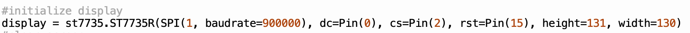

_Figure 9: Initialisierung TFT_

Die Baudrate stellt die Aktualisierungsgeschwindigkeit des Bildschirms da.

DC und CS sind die Pins zur Kommunikation und rst ist für das Resetten zuständig.

An dieser stelle stiessen wir bereits auf das erste Problem der Library.

Denn statt direkt die st7735 Klasse zu verwenden, müssen wir die die Klasse ST7735R Bildschirms verwenden. Der Grund dafür ist uns nicht ganz klar. Dabei müssen wir die Höhe und Breite auf die unseres Bildschirmes anpassen. Was dabei aufgefallen ist, ist dass wir bei Angabe der Breite anhand der Herstellerdaten auf eine inkorrekte Größe kommen. Rechts und unten am Bildschirm war somit ein Pixelrauschen zu sehen, was andeutete, dass der definierte Bereich zu klein war. Nach ausprobieren und ändern der Größe von 128x128 auf 131x130 lies sich das Problem jedoch lösen.

Mit dem Aufruf

Display.fill(0xFFFF)

setzen wir die gesamte Bildfläche auf die Farbe weiss (rgb(255,255,255)).

Dies wird einmal bei Programmstart ausgeführt.

Als nächstes lassen wir den Bildschirm alles zeichnen, was er nur einmal zeichnen muss.

Wir haben uns entschieden auf dem Display die Temperatur und Feuchtigkeitswerte, sowie einen Graphen mit den 10 letzten gespeicherten Werten anzuzeigen.

Die Graphen erhalten die Werte aus einer Json datei, die in 1 Sekundenabstand den Datensatz aktualisiert. Zur Json gehen wir später näher ein.

Zum Zeichnen des Koordinatensystems haben wir eine funktion geschrieben mit dem Namen „drawCoordinateSystem()" (Figure 10).

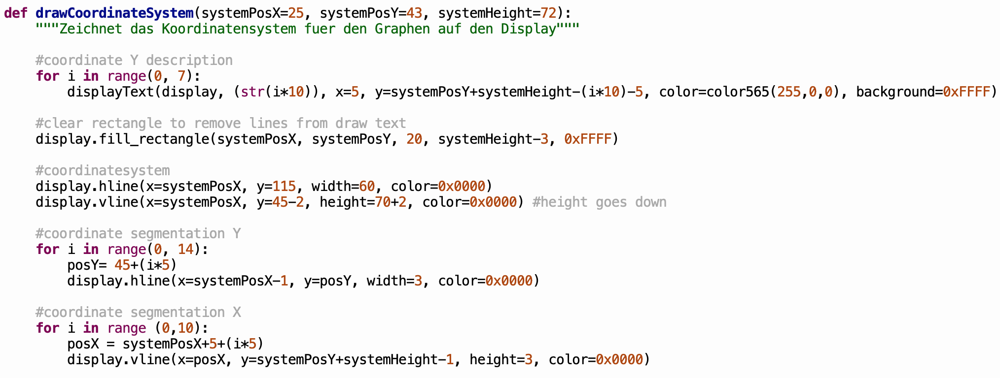

_Figure 10: Funktion drawCoordinateSystem_

Als Parameter setzen wir systemPosX, systemPosY und systemHeight.

systemPosX und systemPosY beschreiben die Position des Koordinatensystems ausgehend von der Ecke oben links. systemHeight beschreibt die Höhe in Y-Richtung. Die Koordinateneinheit ist Pixel.

Mit der ersten for loop zeichnen wir zunächst die Koordinatenbeschriftung der Y-Achse.

Um die Funktion auszuführen benötigt die displayText Funktion aus der rgb\_text.py einige Parameter:

Display= der display auf den die Funktion angewandt wird

Text= die zu seichnende Textstring

x und y= die Koordinaten in Pixel

Color und background = Textfarbe und Hintergrundfarbe

Dabei stoßen wir auf weitere Probleme mit der Library. Der ausgegebene Text enthält eine horizontale Linie die sich weit über den Bereich der Textstring hinausstreckt und die oberste Pixelreihe des Textes wird von dieser Linie verdeckt.

Um dem entgegenzubeugen haben wir eine Zeile in der rgb\_text.py Datei verändert:

_Figure 11: rgb\_text Libraryänderung_

Wir haben y=0 zu y=1 verändert, so dass der Framebuffer die Position des textes eine Zeile niedriger zeichnet (Figure 11).

Ursprünglich hatten wir auch an einer anderen Stelle eine Änderung vorgenommen, die das Zeichnen der Horizontalen verhindert, doch das führte unregelmäßig zu einem out-of-bounds error, den wir nicht korrigieren konnten.

Daher haben wir einen Trick angewandt, damit die Linie nicht in den Bereich des Koordinatensystems geht: Wir überschreiben die linie einfach mit der Hintergrundfarbe(Figure 12).

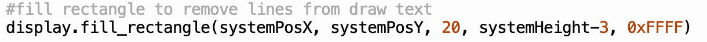

_Figure 12: fill\_rectangle Funktion_

Ausserdem führt das mehrfache Ausführen der Funktion auf die gleiche Y Zeile angewandt dazu, dass der weiter rechts befindliche Text mit schwarzen Pixeln bedeckt ist und somit unleserlich ist.

Da wir Probleme hatten wegen letzterem Grund haben wir uns also dagegen entschieden die Beschriftung für die X Achse einzuführen.

Das Zeichnen der Linien des Koordinatensystems verlief ohne Probleme: mit display.hline und display.vline zeichnen wir Horizontalen und Vertikalen.

Mit einer for-Loop zeichnen wir dadurch in Y-Richtung 14 Zahlengeradenunterteilungen und in X-Richtung 10 Unterteilungen.

Die x-Richtung stellt die 10 letzten gespeicherten Messungen dar, das bedeutet der äußerste Wert (ganz rechts) ist immer der aktuellste Wert.

## Zeichnen der Graphen

Zum Zeichnen der Graphen auf dem Bildschirm haben wir eine weitere Funktion geschrieben: drawGraphs() (Figure 13).

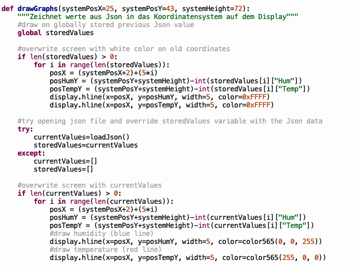

_Figure 13 drawGraphs Funktion_

Diese Funktion liest zu allererst die Variable storedValues aus. Diese Variable ist zu Programmstart nur eine leere Liste. Nachdem drawGraphs jedoch mindestens 1 mal durchlaufen ist, hat storedValues die Json Daten des letzten Durchlaufs.

DrawGraphs funktioniert folgendermaßen:

Die Funktion liest die Json Datei mit den Temperatur und Feuchtigkeitswerten aus. Um dies einfacher zu gestalten sind die Werte als Zahlen ohne Einheitsdaten gespeichert.

Ensprechend der Werte wird ausgehend von dem Koordinatensystem ermittelt an welcher Stelle die Funktion eine Linie zeichnen soll. Dabei entspricht 1 Pixel in Y Richtung einem Grad Celsius bzw. 1% Luftfeuchtigkeit. Die Floatwerte casten wir zu Integerwerten, da es nur ganze Pixel gibt.

Erst wird geprüft ob storedValues Daten hat, wenn ja werden diese Daten verwendet um die Pixel weiss zu Färben. Dadurch verschwinden die zuvor gezeichneten Linien. Dann wird storedvalues mit den aktuellen Json-Daten überschrieben, die sich an anderer Stelle aktualisiert haben, so dass storedValues und die gespeicherte Json nicht die gleichen Daten beinhalten.

Diese storedValues werden global überschrieben, denn drawGraphs() greift in der nächsten Iteration wieder auf diese zu um die alten Pixel zu überschreiben.

Als Nächstes werden die neuen Pixel eingefärbt. Dazu wird die variable „currentValues" verwendet. Mit loadJson() speichern wir die Daten, damit sie sich nicht während des zeichnens aktualisieren.

Mit einer for-Schleife zeichnen wir für jede stelle in der Json-Liste die Temperatur in rot und die Feuchtigkeit in blau.

Hier haben wir die funktion color565() aus der rgb library verwendet um rgb-Werte in Hex umzuwandeln.

## Zeichnen der Sensordaten

Zum Zeichnen der Sensordaten haben wir die Funktion drawTempHum() (Figure 14) geschrieben. Dadurch werden die Sensordaten fix an de Koordinaten x=5 y=20 und x=5 y= 30 als Text auf dem Bildschirm gezeichnet.

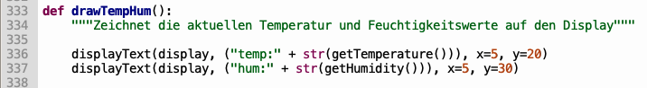

_Figure 14 drawTempHum Funktion_

Hier verwenden wir die von uns geschriebenen Funktionen getTemperature() und getHumidity().

_Figure 15 getTemperature und getHumidity Funktionen_

Da wir den Sensor bereits initialisiert haben können wir diese Funktionen (Figure 15) nun überall verwenden.

## Auto-Aktualisierung des Bildschirm

Dazu haben wir die Schleife aus der Datei main.py verwendet, die uns zur Verfügung gestellt wurde (main.py) und sie für uns angepasst,

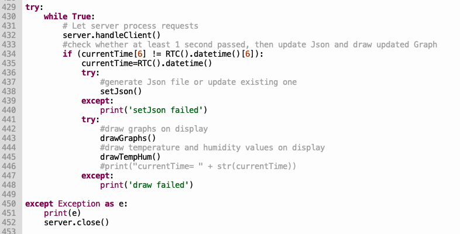

_Figure 16 Main While Loop_

Eine while-Schleife läuft durgehend ab, bis eine Exception Eintritt, bei der der Server sich selbst beendet (Figure 16). Server.handleClient() emöglicht dem Servor Verbindungsanfragen zu bearbeiten. Die if-Condition prüft ob eine Sekunde verstrichen ist und überschreibt dann den zuvor gespeicherten currentTime Wert mit der aktuellen Zeit. Wir versuchen als nächstes in einem try-except block die Json mit unserer geschriebenen setJson() Funktion zu aktualisieren. Diese wird im nächsten try block benötigt: zum zeichnen der Graphen. Nach der drawGraphs() Funktion wird die draw TempHum() Funktion zum Zeichnen der aktuellen Sensordaten ausgeführt. Sollte einer der Schritte fehlschlagen, erhalten wir eine Benachrichtigung in der Konsole.

# Wohlgeformtes XML

Wir haben in unserem Projekt nicht die Ausgabe als XML eingebaut, gehen aber dennoch auf das Format ein (wiki.selfhtml.org, 2022).

Wohlgeformtheit was XML angeht, bedeutet dass eine Datei die Regeln von XML korrekt einhält.

1. Zu Beginn steht eine XML-Deklaration
2. Es gibt mindestens ein Datenelement
3. Es gibt bei den Datenelementen ein äußeres Element, das alle anderen Datenelemente enthält.

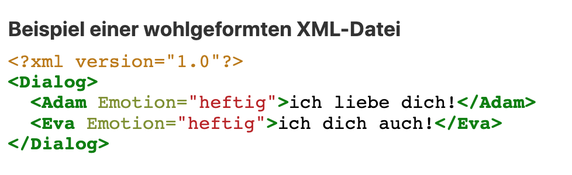

_Figure 17 wohlgeformtes XML von wiki.selfhtml.org_

# Allgemeines zum JSON-Format

JSON ist ein leichtgewichtiges Datenaustauschformat. Der standard wurde festgelegt von ECMA, einem internationalen Branchenverband, der sich der Standardisierung von Informations- und Kommunikationssystemen widmet (vgl ecma-international.org). JSON steht für Javascript Object Notation, ist jedoch eine sprachenunabhängige Konvention und wird in C-Sprachen, Java/Javascript, Perk, Python und vielen weiteren verwendet (json.org, 2022).

JSON baut auf 2 Strukturen auf:

1. Eine Sammlung an Namen/Werte Paaren. Dies kann beispiesweiße in Form von einem Object, einem struct, dictionary, has table oder einer keyed list sein.
2. Eine sortierte liste an Werten. Dies kann in Form einer Array, enes Vektors, einer Liste oder einer Sequenz sein.

Werte werden durch ein Komma getrennt, dabei können unendlich viele whitespaces zwischen den Werten liegen.

(vgl. json.org/json-en.html)

_Figure 18: JSON Objekt_

_Figure 19: JSON Array_

In Arrayform beginnt und endet die JSON mit eckigen Klammern.

In Dictionaryform beginnt und endet sie mit geschweiften Klammern.

Für uns erschien es am sinnvollsten die Json in Arrayform zu gestalten, die dictionaries enthält.

# Speichern und Laden einer JSON-Datei

Um Daten in JSON-Dateien zu speichern, müssen Sie zunächst die json Library importieren(Figure 20).

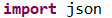

_Figure 20 json Import_

Für das erstellen und/oder Aktualisieren einer JSON-Datei haveb wir die Funktion setJson geschrieben.

Dann speichern wir die aktuellen Sensordaten mit unseren get-Funktionen in die Variablen temp und hum. Außerden speichern wir in measureTime die Zeit.

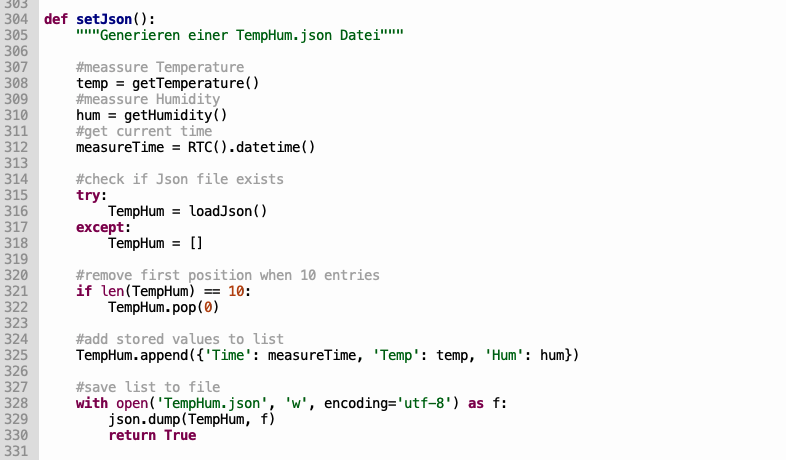

_Figure 21: setJson Funktion_

Gibt es bereits eine Json Datei mit dem Namen TempHum.json, so wird die Liste als Ausganspunkt für die Aktualisierung verwendet. Gibt es die Datei nicht wird eine neu erstellt. Das machen wir über den try-except Block.

Die Funktion(Figure 21) erweitert die Liste bei jedem aufruf um einen Datensatz, bis 10 Datensätze vorhanden sind.

Sobald 10 Datensätze vorhanden sind wird die List nicht mehr vergrößert.

Dann wird nämlich immer der erste Datensatz gelöscht und am Ende der Liste ein neuer Datensatz mit den Beginn gespeicherten Werten hinzugefügt.

Im letzten Schritt speichern wir die Daten in die Datei im Rootverzeichnis.

Im späteren Verlauf haben wir die Json noch um die entprechenden Einheiten ergänzt (nicht in der Abbildung): Prozent für Feuchtigkeit und C für Grad Celsius.

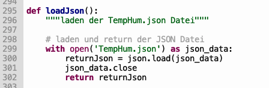

_Figure 22: loadJson Funktion_

Das Laden der Json ist dagegen vergleichsweise einfach.

Wir haben dies als Funktion loadJson() definiert (Figure 22), die uns die Json als Liste zurückgibt.

# Die handleroot Funktion und die HTML

Mit der Funktion handleroot() legen wir die html String fest, die der Server an die Clients schickt.

Diese haben wir über einen Stringformatter in der Variable „page" gespeichert.

Hier findet unsere loadJson() Funktion Verwendung. Sie wird benötigt um unsere gespeicherten Daten in eine Tabelle zu schreiben. Da jedoch der Stringformatter Probleme hat unsere Liste auszulesen, haben wir die daten einzeln in variablen gespeichert. Diese wurden zuvor als leere String initialisiert.

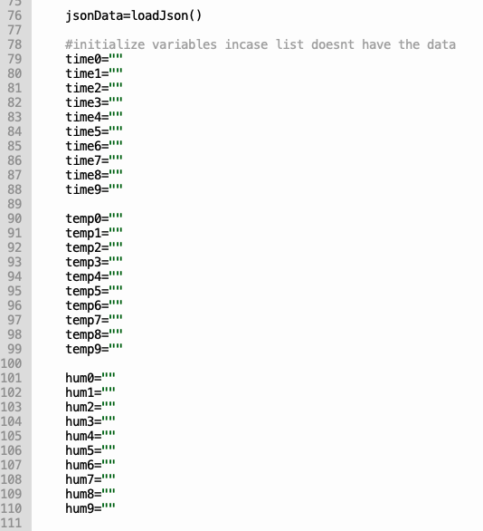

_Figure 23: Variablen Initialisierung handleroot_

Da unser rootHandler nicht weiss, wie groß die Json Liste ist, muss erstmal geprüft werden, ob an den jeweiligen Stellen Daten existieren, bevor wir die Variablen überschreiben können (Figure 23).

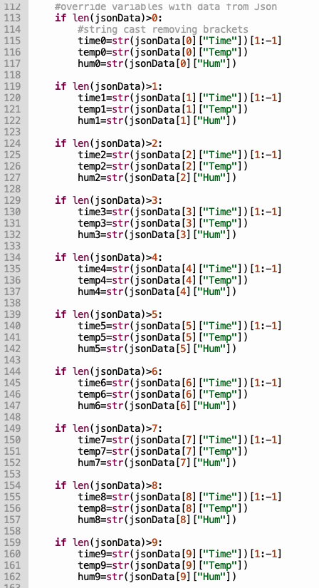

_Figure 24: Variablenüberschreiben handleroot_

Daher haben wir für jede länge eine Kondition festgelegt, nach der die Daten als String eingetragen werden (Figure 24).

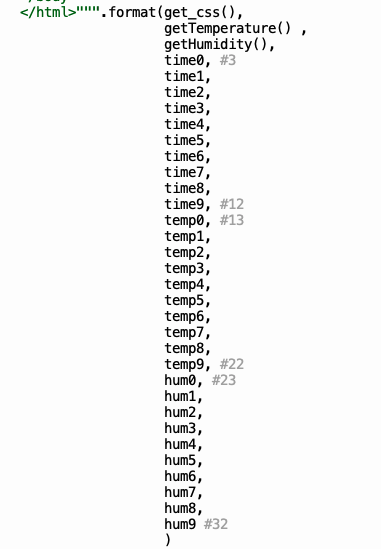

_Figure 25 Stringformatter Variablenübergabe_

Über den Formatter werden diese Variablen dann in der String der HTML an entsprechenden Stellen eingetragen (Figure 25).

_Figure 26: Ausschnitt der HTML String_

Über geschweifte Klammern und mit Angabe der Position lässt sich dies umsetzen in der HTML umsetzen (Figure 26).

Am Ende der Tabelle haben wir einen Downloadbutton eigefügt, über den die Json der Tabelle einfach heruntergeladen werden kann (Figure 27).

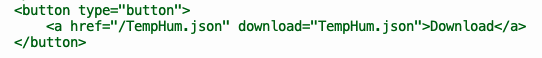

_Figure 27 JSON Download Button_

Die CSS wird im header eingesetzt und das geschieht über die Funktion get\_css (Figure 28).

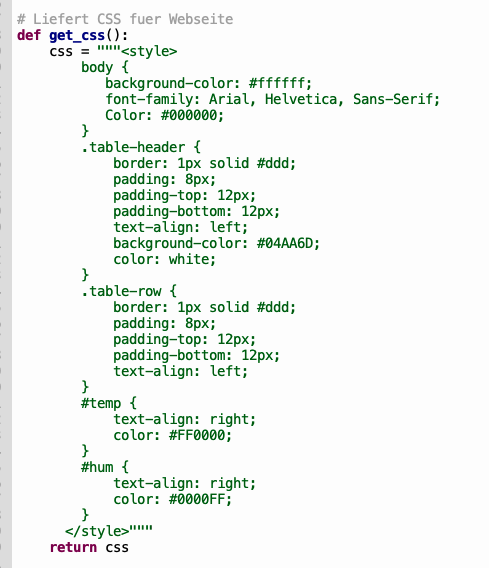

_Figure 28 get\_css Funktion_

Hier haben wir den Style für unsere Tabelle festgelegt mit IDs und Klassen.

Body legt global die Font, Textfarbe und den Hintergrund fest.

Die Klasse table-header ist für die Kopfzeile unserer Tabelle und die Klasse table-row für die Tabellenzeilen. Die ids temp und hum legen dann für die entsprechenden Spalten die Schriftfarbe und die Textausrichtung fest.

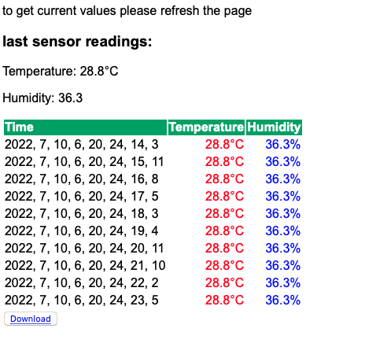

_Figure 29: Ausgabe im Webbrowser_

Die Seite sieht damit dementsprechend wie in der Abbildung aus (Figure 29).

Über die Pfade „/json" „/humidityValue" und „temperatureValue" lassen sich außerdem die json als rohe Json Datei anzeigen lassen, sowie die Feuchtigkeits- und Temperaturwerte alleine als plainValue.

# Probleme und Lösungen

Da der Server ständig die Verbindung trennte, wenn wir eine zu große HTML Datei hatten, haben wir in der ESP8266WebServer.py in der \_\_sendPage() Funktion die Datengröße beim read Befehl in Zeile 67 von 64 auf -1 gesetzt, damit wir keine Beschränkung für Datengröße haben (Figure 30).

_Figure 30: sendPage Änderung_

Außerdem haben wir den timeout der handleClient() Funktion von 5.0 auf 10.0 erhöht, da wir in der main-while-Schleife viele Funktionen hintereinander ausführen, die den request-Prozess ein wenig verzögern können (Figure 31).

_Figure 31: handleClient Funktionsänderung_

Eine Alternative dazu wäre es mit der uasyncio Library den Clienthandler und die setJson funktion, sowie die Draw-Funktionen parallell laufen zu lassen, doch da dies bei uns nicht korrekt funktionierte und uns eine MemoryException uns dabei unteranderem Schwierigkeiten bereitete, haben wir den Ansatz verworfen.

Die Anzahl an Clients, die mit dem Server verbunden sein können war zuvor auf 1 gesetzt. Wir haben die Anzahl erhöht auf 3 in Zeile 38(Figure 32).

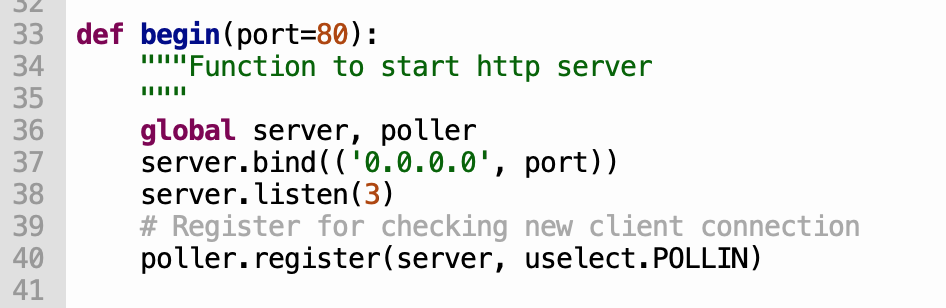

_Figure 32: Server begin Funktion_

# Kommunikationsplan

| Nachname | Vorname | E-Mail |
| --- | --- | --- |
| Potozki | Martin | XXXX@gmail.com |
| Schiff | Marvin | XXXX@outlook.com |

Im Allgemeinen teilten wir uns die Arbeit gut auf. Martin war jedoch für den Python-Code im Allgemeinen verantwortlich, da er die meisten Recherchen auch nach dem Unterricht durchführte. Außerdem blieb er immer sitzen, bis der Code funktioniert.

Marvin kümmerte sich um die Dokumentation des gesamten Projekts. Er führte seinerseits auch viele Recherchen durch, um Martin zu helfen und Martin ergänzte die Dokumentation entsprechend. Ein Teil des Codes wurde durch Coprogramming im Unterricht durchgeführt und der Rest Zuhause.

# Schlusswort

Zusammenfassend lässt sich sagen, dass die Arbeit gut verteilt war. Jeder hatte etwas zu tun, sei es bei der Dokumentation oder bei der Hilfe bei der Suche nach Libraries. Die Arbeit wurde in einer guten Arbeitsatmosphäre erledigt.

Unsere Kommunikationsmittel waren hauptsächlich das Telefon, sei es WhatsApp oder auch Discord.

# Literaturverzeichnis

_wiki.selfhtml.org_. (10. July 2022). Von XML/REGELN/Wohlgeformtheit: https://wiki.selfhtml.org/wiki/XML/Regeln/Wohlgeformtheit abgerufen

_json.org_. (10. July 2022). Von Introducing JSON: https://www.json.org/json-en.html abgerufen
